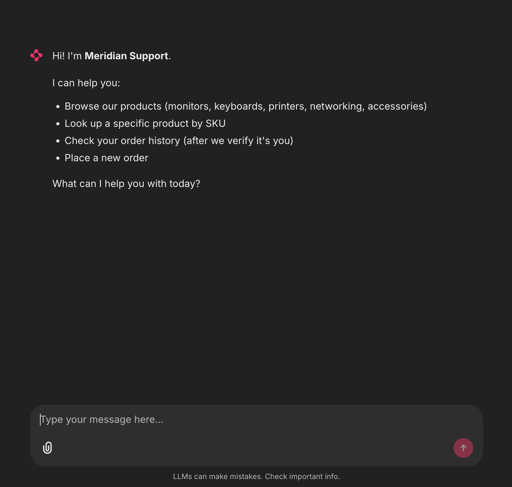
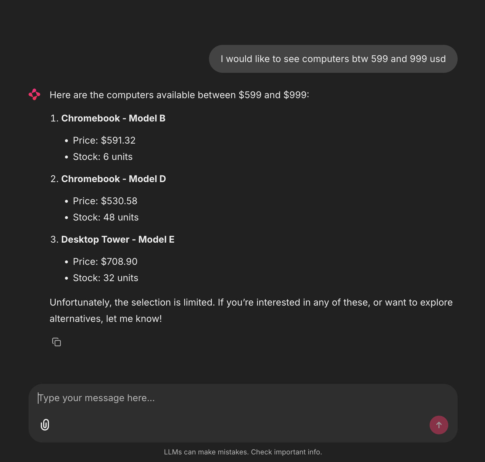

# Meridian Support — AI Customer Support Chatbot

A production-grade prototype that lets Meridian Electronics customers check product availability, place orders, look up order history, and authenticate themselves — all through a chat interface backed by an MCP server.

---

## Architecture

```
┌──────────────┐      ┌─────────────────┐      ┌──────────────────────┐      ┌─────────────────┐
│  Chainlit    │      │  Agent loop     │      │  MCP client          │      │  Meridian MCP   │
│  chat UI     │ ───▶ │  (openai-agents │ ───▶ │  (Streamable HTTP    │ ───▶ │  server         │
│              │      │   SDK)          │      │   transport)         │      │                 │
│  - streaming │      │  - tool calls   │      │  - dynamic discovery │      │  - products     │
│  - cl.Step   │      │  - structured   │      │  - tool dispatch     │      │  - orders       │
│  - sessions  │      │    output       │      │                      │      │  - auth         │
└──────────────┘      └─────────────────┘      └──────────────────────┘      └─────────────────┘
       │                      │
       │                      ├── Guardrails (input scrubbing, prompt-injection defense)
       │                      ├── Auth state in cl.user_session (verified email only)
       │                      └── System prompt scoped to Meridian + safety rules
       └── LangFuse traces (every turn, every tool call, every token)
```

**Three layers, one job each:**

- **UI layer (Chainlit):** chat surface, streaming, step visualization for tool calls — what the customer sees.
- **Agent layer (openai-agents SDK):** the LLM loop, tool selection, structured output. Guardrails sit at this boundary so injection attempts and unauthenticated account requests are stopped *before* the model decides to call a tool.
- **Tool layer (MCP, Streamable HTTP):** the chatbot has zero hard-coded business logic. It discovers tools dynamically from the MCP server at startup. Adding a new capability is a server-side change — no chatbot redeploy.

---

## Stack

| Concern | Choice | Why |
|---|---|---|
| **UI** | Chainlit `>=2.0` | Native MCP support, built-in step visualization (live tool-call rendering), streaming, sessions. |
| **Agent loop** | `openai-agents` SDK | Anthropic's MCP-native agent runtime. Auto-discovers MCP tool schemas, handles the loop, supports structured Pydantic outputs. |
| **Model** | `gpt-4o-mini` | Cost-effective tier per the brief. Strong tool-calling, ~$0.15 / 1M input tokens. |
| **MCP transport** | Streamable HTTP | Matches the deployed server (`order-mcp-74afyau2q-uc.a.run.app/mcp`). |
| **Auth** | Email + 4-digit PIN, verified via MCP tool | Stateless — only the verified email is held in session, never the PIN. |
| **Tracing** | LangFuse | Per-turn traces, token counts, latency, tool-call timeline — visible during the demo. |
| **Tests** | pytest + pytest-cov | Guardrails unit tests + lightweight agent integration tests with a mocked MCP. |
| **CI** | GitHub Actions (Python 3.11/3.12 matrix, ruff + pytest) | Wired and green. |
| **Deploy** | HuggingFace Spaces (Docker SDK) | Per the brief's minimum-deploy requirement. |

---

## Screenshots

The bot in action and behind the scenes. Click any thumbnail to view full-size.

### Welcome screen


### Product browse


### LangFuse traces
Per-turn observability — model, prompt, response, token counts, latency, and cost for every LLM call.


### OpenAI usage
Cost and request volume against the OpenAI API.


---

## Deployment

The chatbot deploys to Hugging Face Spaces via GitHub Actions. Every push to `main` runs the test matrix; on success, the workflow force-pushes the repo to the Space's git remote, which triggers HF to rebuild the Docker image.

### One-time setup

1. **Create the Space** on huggingface.co (Spaces → Create new Space → SDK: Docker). Note the Space name.

2. **Generate a write token** at https://huggingface.co/settings/tokens (scope: `Write`).

3. **Add three GitHub Actions secrets** (repo Settings → Secrets and variables → Actions → New repository secret):

   | Secret | Value |
   |---|---|
   | `HF_TOKEN` | the write token from step 2 |
   | `HF_USERNAME` | your Hugging Face username |
   | `HF_SPACE` | the Space name from step 1 (e.g. `meridian-support`) |

4. **Add runtime secrets to the HF Space** (Space → Settings → Variables and secrets):

   | Secret | Required | Notes |
   |---|---|---|
   | `OPENAI_API_KEY` | yes | OpenAI key for `gpt-4o-mini` |
   | `MCP_SERVER_URL` | yes | `https://order-mcp-74afyau2q-uc.a.run.app/mcp` |
   | `CHAINLIT_AUTH_SECRET` | yes | output of `chainlit create-secret` |
   | `LANGFUSE_PUBLIC_KEY` | optional | tracing — leave blank to disable |
   | `LANGFUSE_SECRET_KEY` | optional | tracing |
   | `LANGFUSE_HOST` | optional | defaults to `https://cloud.langfuse.com` |

### Deploy

Push to `main`. The Actions workflow runs lint + tests across Python 3.11/3.12, then deploys. The Space rebuilds in ~2-3 minutes; live URL is `https://huggingface.co/spaces/<HF_USERNAME>/<HF_SPACE>`.

### Local Docker

```bash
docker build -t meridian-support .
docker run --rm -p 7860:7860 --env-file .env meridian-support
# open http://localhost:7860
```
